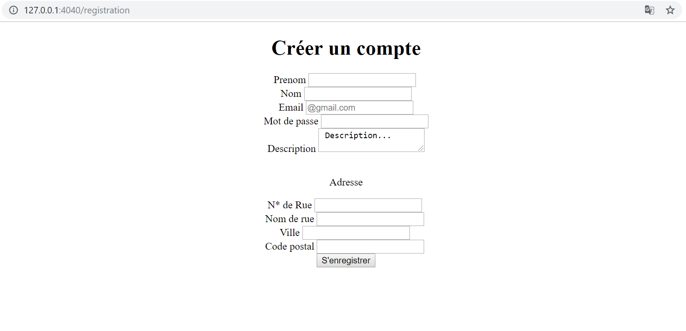

<!DOCTYPE html>
<html lang="en">
<head>
    <meta charset="UTF-8">
    <meta name="viewport" content="width=device-width, initial-scale=1.0">
    <meta http-equiv="X-UA-Compatible" content="ie=edge">
    
</head>
<body>
  <h1>flask_sql_html</h1>
   
   
   

      

        
      

      

        
      

  

  
</body>
</html>

